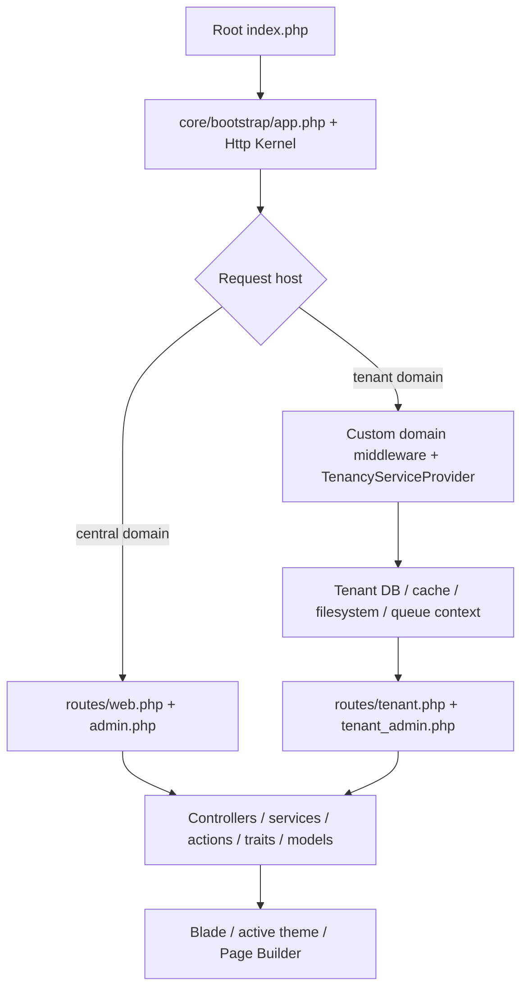

# Architecture

## VERIFIED — request and code boundaries

Source: `index.php`, `core/bootstrap/app.php`, `core/app/Http/Kernel.php`, `core/app/Providers/RouteServiceProvider.php`, `core/app/Providers/TenancyServiceProvider.php`. Global middleware includes proxy handling, request-size validation and installer middleware. API topology is detailed in [AUTHORIZATION](AUTHORIZATION.md).

| Location | Responsibility |
|---|---|
| `core/app/Http/Controllers/Landlord`, `Tenant` | Central/storefront/admin request handlers; some landlord-namespaced controllers are reused by tenant routes |
| `core/app/Http/Services`, `core/app/Services`, `core/app/Actions` | Distributed business operations/rendering/provisioning; not one uniform service layer |
| `core/app/Models`, `core/Modules` | Eloquent, query-builder, module entities/services/traits; connection ownership matters more than namespace |
| `core/app/Helpers` | Composer-autoloaded global helpers; `funtions.php` spelling is intentional |
| `core/config`, `core/database` | Configuration defaults and central/tenant schema/seed paths; many live settings are DB options |
| `core/resources/views`, `core/resources/js`, `core/resources/css` | Blade and selected Vue/Vite entry sources |
| `assets`, `core/public` | Shared/bundled static assets plus excluded runtime publication surfaces; identify source before editing |

No `core/app/Repositories` directory exists. Direct controller queries coexist with services and traits. Source: current directory inventory, `core/composer.json`, product and checkout chains in [CODE-MAP](CODE-MAP.md).

## VERIFIED — themes

- Source: `core/themes/{slug}/theme.json`, `views`, `assets`, optional `Widgets` and `demo`. `ThemeServiceProvider` activates `tenant()->theme_slug` on `TenancyInitialized`.
- `ThemeManager` orders `theme::` lookup: active theme → default theme → `core/resources/views/tenant`. It replaces the **view factory's** finder namespace and flushes resolved paths. Stable namespaces are `theme-{slug}::`.
- Theme module overrides use `views/modules/{module-name}`. Widgets are discovered from `themes/*/Widgets/*.php`, derive `Themes\{StudlySlug}\Widgets\Class`, and feed `xgpagebuilder.custom_widgets`.
- `ThemeDemoImporter` handles theme data/layout import; `TenantDatabaseSeeder` calls it before optional theme-specific extras. Demo imports alter content; they are not harmless asset publication.
- Published `core/public/themes`, root theme links and `_build` are outputs. Extend the actual active theme and preserve its hook/RTL conventions; do not edit symlink outputs.

Source: `core/app/Providers/ThemeServiceProvider.php`, `core/app/Services/ThemeManager.php`, `core/app/Services/ThemeDemoImporter.php`, `core/database/seeders/TenantDatabaseSeeder.php`, `core/config/theme.php`, `.gitignore`.

## VERIFIED — Page Builder

| Implementation | Entry / registry | Persistence / render |
|---|---|---|
| Legacy | `core/plugins/PageBuilder/PageBuilderSetup.php`, `Addons`, `Fields`; landlord PageBuilderController | `App\Models\PageBuilder`, `page_builders`; legacy views/serialized addon settings |
| Xgenious 1.7.1 | `CustomPageBuilderController`; `CustomPageBuilderServiceProvider` registers API; `FilteredWidgetController` honors widget `enable()`; `core/config/xgpagebuilder.php` | `pages.use_page_builder`, `page_builder_content`, `page_builder_widgets`, editing sessions; vendor renderer bound to local `CustomPageBuilderRenderService` |

`AppServiceProvider` registers central/tenant editor paths and the renderer binding. `core/plugins/WidgetBuilder` supplies widget classes/views; themes add their own widgets. Inspect page flags and stored format first; preserve widget type/settings keys. Do not infer an old custom history extension exists because a vendor history endpoint still exists.

Source: `core/app/Providers/AppServiceProvider.php`, `core/app/Providers/CustomPageBuilderServiceProvider.php`, `core/app/Http/Controllers/FilteredWidgetController.php`, `core/app/Services/CustomPageBuilderRenderService.php`, `core/database/migrations/tenant/2024_01_01_000001_create_page_builder_content_table.php`, `core/database/migrations/tenant/2024_01_01_000002_create_page_builder_widgets_table.php`.

## VERIFIED — extensibility

Nwidart registers `module.json` providers/routes; custom `PluginManager` discovers `Modules/*/plugin.json` and `plugins/*/plugin.json`. Both contracts coexist; not every module has a plugin manifest. Plugin IDs differ from module directory names. `PluginServiceProvider` pre-registers routes, boots context-appropriate active plugins, then boots tenant plugins when tenancy initializes. Global status file plus central tenant overrides affect activation. Hooks, asset queues, menus, options, schedules and shortcodes have separate managers.

Preferred real extension points: active-theme view/asset/widget; module-local controller/service; `PluginBase` with existing `HookEngine` actions/filters; registered event/listener. Plugin presence alone neither grants permission nor guarantees plan eligibility. Plugin boot can run pending lower-case `database/migrations` and cache the check even after failure: investigate carefully.

Source: `core/config/modules.php`, `core/app/PluginSystem/PluginManager.php`, `PluginBase.php`, `HookEngine.php` in the same directory; `core/app/Providers/PluginServiceProvider.php`. Detailed inventories: [MODULES](MODULES.md).
