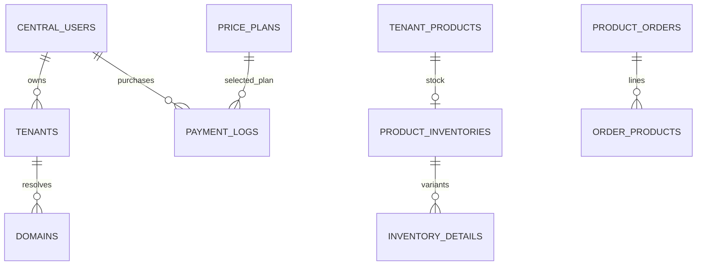

# Data model

## VERIFIED — declared models and ownership

These are source/model/migration facts, not a dump of the deployed database. A relationship declared in Eloquent is not necessarily a database foreign key. Read later migrations before changing a column.

| Data family | Models / tables | Ownership and relationships |
|---|---|---|
| Central accounts | `core/app/Models/User.php` → `users`; Admin → `admins` | Central owners have many tenants/payment logs. User is soft-deleted. Both models are also used in tenant context |
| Tenants/domains | `Tenant.php`, `UserDomain.php`, `CustomDomain.php`; `tenants`, `domains`, `custom_domains` | String tenant key; `tenants.user_id`; incoming host mapping via domains; custom-domain workflow is separate |
| Subscription ledger | `PaymentLogs.php` → `payment_logs` | Explicit CentralConnection; user, tenant, plan; payment/status/expiry/renewal/recurring fields |
| Plan entitlements | `PricePlan.php`, `PlanFeature.php`, `PlanTheme.php`, `PlanPaymentGateway.php` | `price_plans`, `plan_features`, `plan_themes`, `plan_payment_gateways`; do not assume removed plan-plugin entitlement tables remain active |
| Physical catalog | `core/Modules/Product/Entities/Product.php` → `products` | Tenant product, soft deletes; inventory, variants, gallery, categories, tags, delivery/specification and slug/meta relations |
| Inventory | Product module `ProductInventory`, `ProductInventoryDetail`, `ProductInventoryDetailAttribute` | `product_inventories`, `product_inventory_details`, attribute relation table; stocks and sold counts are distinct |
| Tenant order | `core/app/Models/ProductOrder.php` → `product_orders` | Explicit TenantConnection; buyer nullable; totals, order details/payment metadata, gateway, payment and fulfillment states |
| Order lines | `core/app/Models/OrderProducts.php` → `order_products` | Default context connection; order/product/variant IDs, quantity, price, product type |
| Store payment setup | `core/app/Models/PaymentGateway.php` → `payment_gateways` | Tenant payment configuration; distinguish from central subscription gateway settings |
| CMS | `Page.php`, `PageBuilder.php`, `Slug.php`, `MetaInfo.php` | `pages`, `page_builders`, `slugs`, `meta_infos`; new builder also uses normalized content/widget tables |
| Settings/media/language | `StaticOption.php`, `StaticOptionCentral.php`, `MediaUploader.php`, `Language.php` | DB options, media metadata, languages; central marker exists only on designated model; binary files are runtime outside Git |
| Permissions | Spatie models/config | `roles`, `permissions`, `model_has_roles`, `model_has_permissions`, `role_has_permissions`; separate DB context |
| Shipping/tax/coupon | ShippingModule, TaxModule, CouponManage entities | Zones/regions/methods/addresses, tax classes/options, product coupons/usage |
| Wallet/commission | Wallet and CommissionManage entities | Monetary ledgers, balances, selected gateways, withdrawals; inspect connection traits per entity before joining |
| Plugin settings/status | PluginManager/PluginBase | Global file status plus central `plugin_tenant_overrides`; plugin options scoped by plugin/tenant; module-specific tables in manifest |

Model paths above are under `core/app/Models` unless otherwise qualified. Additional module tables and source locations: [modules.yaml](manifests/modules.yaml). Named core entities: [entities.yaml](manifests/entities.yaml).

## VERIFIED — important schema constraints

| Constraint | Evidence |
|---|---|
| domains.domain unique; tenant_id string FK → tenants.id, cascade | `core/database/migrations/2019_09_15_000020_create_domains_table.php` |
| products soft deletes; indexed name/slug, badge/brand fields | `core/database/migrations/tenant/2022_08_01_065701_create_products_table.php` |
| inventories product_id unique, SKU unique; product FK cascade | `core/database/migrations/tenant/2022_08_01_104521_create_product_inventories_table.php` |
| inventory details link product and inventory; product FK cascade | `core/database/migrations/tenant/2022_08_01_104531_create_product_inventory_details_table.php` |
| order_products.order_id FK → product_orders.id, cascade; product/variant in initial migration are integers without FKs | `core/database/migrations/tenant/2022_10_16_174456_create_order_products_table.php` |
| New builder content/widget relationships and indexes | `core/database/migrations/tenant/2024_01_01_000001_create_page_builder_content_table.php`, `core/database/migrations/tenant/2024_01_01_000002_create_page_builder_widgets_table.php` |

Diagram denotes logical/model relationships; only explicitly listed FKs are asserted as schema constraints. Central and tenant entities are not in one shared database join.

## VERIFIED — status contracts and gotchas

Subscription `payment_status=complete` differs from store order `payment_status=success`; fulfillment uses `complete`/`cancel` separately. Product uses status IDs and Status model, not order status strings. Several data fields are serialized/JSON-shaped without universal casts. Some older relation names are misleading (`PaymentLogs::price_plan`, tenant `OrderManageController::pending_orders`); follow the actual query.

Core product table creation is in `database/migrations/tenant`, while some Product module migrations only **alter** those tables. Never infer table ownership solely from the module migration folder. Fresh installation and deployed schema parity: UNKNOWN-002.
